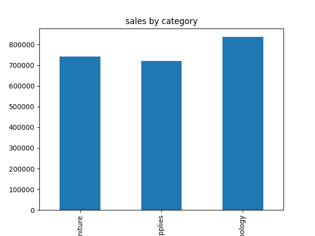

# Superstore Sales Analysis

## 📌 Project Overview
This project analyzes sales data from the Superstore dataset to understand business performance and generate insights.

---

## 🛠️ Tools Used
- Python
- Pandas

---

## 📊 Dataset
- Superstore Sales Dataset (CSV file)

---

## 🔍 Analysis Performed
- Calculated total sales
- Calculated total quantity sold
- Identified top 5 products by sales
- Identified lowest selling products
- Analyzed sales by category
- Analyzed sales by region
- Identified top customers

---

## 📈 Key Insights
- Top-performing products generate the highest revenue
- Some products have very low sales and need attention
- Sales vary across different regions and categories

---

## 📁 Project Structure
- python/day11_kaggle.py
- data/Sample - Superstore.csv
- output/top_products.csv

---

## 📊 Visual Insights

### Sales by Category

### Top Products

### Sales by Region

